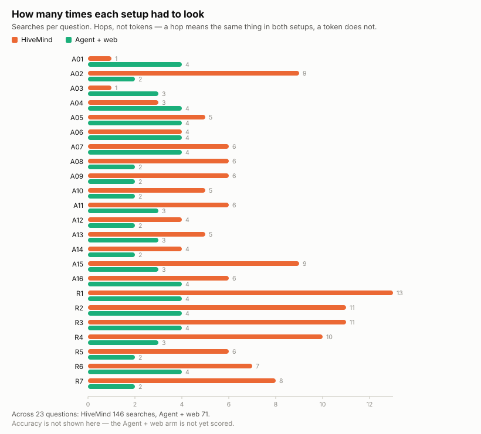
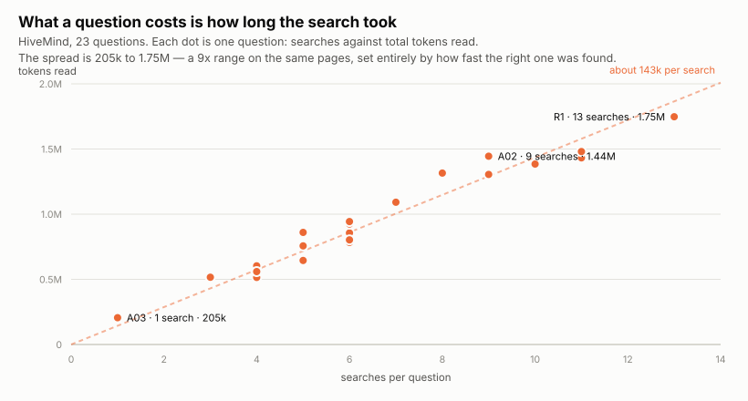

# Benchmark

If you are about to drive PowerWorld from Python with an AI assistant, this page tells you
what PowerWorldHiveMind changes, what it does not, and what it costs.

**It solved 19 of 23 questions against 6 for a capable assistant with a web browser.**
The gap is almost entirely in one place: **15 of 16** against
**4 of 16** on the failures PowerWorld does not report as failures. On
looking up a command name it is far weaker — 4 of 7 — and slower and
more expensive than a web search for the same job.

## What was compared

| Setup | What that means |
|---|---|
| **HiveMind** | the assistant has this repository on disk, and nothing else |
| **A fresh assistant + web** | a capable coding assistant told nothing about PowerWorld, with no documentation and no files, free to search the open web |

Both answered the same 23 questions. Every answer was then marked right or wrong by a
grader that saw a reference answer and the candidates **without knowing which setup wrote
which**. Two answers were planted in the pile to test the grader: one correct but worded to
avoid every obvious keyword, one fluent and confidently backwards. It caught both. Had it
missed either, every score here would have been thrown away.

**Right or wrong only — there is no partial credit.** An earlier version of this benchmark
used a three-level scale, and the middle level is where two of five scoring errors hid: a
wrong answer marked *partly right* reads as a judgement call rather than a mistake, so
nobody re-checks it.

---

## 1. Questions where PowerWorld lies to you

Simulator accepts the call, reports success, and returns something wrong. Nothing raises an
error. These are the ones that cost you a day.

| Q | The question | HiveMind | Fresh assistant + web |
|---|---|:--:|:--:|
| A01 | Saved a case and no file appeared | ✅ | ❌ |
| A02 | Set MW on only the coal units | ✅ | ❌ |
| A03 | A DC solve hid a short schedule | ✅ | ✅ |
| A04 | Created lines, nothing was created | ✅ | ❌ |
| A05 | Setting the N-1 voltage limits | ✅ | ❌ |
| A06 | Which outage caused which overload | ✅ | ❌ |
| A07 | An area filter hid tie-line problems | ✅ | ❌ |
| A08 | Violations from a case never solved | ✅ | ❌ |
| A09 | Sorting violations worst-first | ❌ | ❌ |
| A10 | One outage per new generator | ✅ | ❌ |
| A11 | Total system inertia | ✅ | ✅ |
| A12 | Reclassifying lines as transformers | ✅ | ❌ |
| A13 | What hourly wind and solar needs first | ✅ | ❌ |
| A14 | Capacity factor from the output file | ✅ | ❌ |
| A15 | It solves in DC — trust it for AC? | ✅ | ✅ |
| A16 | Speeding up a two-hour outage run | ✅ | ✅ |
| | **solved** | **15 of 16** | 4 of 16 |

**This is what the repository is for.** A fresh assistant with the whole open web could
confirm 4 of these 16. Public documentation describes what a command does;
it does not tell you that the call returns success and writes nothing, or that a filter
silently drops every tie-line, or that a field you are summing is already on a different
base than you think.

**A09 defeated both.** On A09, both mixed raw thermal percentages with voltage deviations, so every
thermal row outranks every voltage one — the same mistake the planted backwards answer
made, which the grader also caught.

---

## 2. Looking up a command: open PowerWorld's manual

| Q | The question | HiveMind | Fresh assistant + web |
|---|---|:--:|:--:|
| R1 | Run a security-constrained OPF | ❌ | ❌ |
| R2 | Export the Ybus for MATLAB | ✅ | ✅ |
| R3 | Renumber the buses | ❌ | ❌ |
| R4 | Built-in LODF screening | ✅ | ❌ |
| R5 | Combine and crop weather files | ❌ | ❌ |
| R6 | Set participation factors | ✅ | ✅ |
| R7 | Reduce a case to an equivalent | ✅ | ❌ |
| | **solved** | **4 of 7** | 2 of 7 |

Neither setup is good at this. HiveMind gets 4 of 7 and spends
**66 searches** doing it, against 23 for the web. This repository
deliberately does not publish argument syntax — the *Auxiliary File Format* manual is
PowerWorld's copyright — so on several of these it names the right command and still cannot
give you a signature to call it with.

**If your question is "what is this command called", open the manual.**

---

## 3. What it costs

**Cost here is counted in searches, not tokens.** A search means the same thing in both
setups: the assistant did not know, and went to look. A token does not — the two ran under
different harnesses, and separately, the same knowledge base searched 8.1 times per question
when asked an ordinary question and 14.3 times when asked for the best answer it could give.
One sentence of instruction moved cost by 1.8x. **Ranking setups by tokens partly ranks the
instructions they happened to be given.**

| | Solved | Searches | **Searches per question solved** |
|---|:--:|--:|--:|
| **HiveMind** | **19 of 23** | 146 | **7.7** |
| Fresh assistant + web | 6 of 23 | 71 | 11.8 |

HiveMind searches about twice as often in total (146 against 71) and still costs less
per question it actually solves. It looks harder and finds more.

### Within one setup, cost is set by how fast the page is found

Every search re-reads the conversation so far, and that re-read is where the tokens go —
about **143k per search**, near enough constant whatever the question. So a question's cost
is very nearly *searches x 143k*, and little else moves it.

The result is a **9x spread across questions on the same pages**:
205k tokens when the right page is found immediately (saved a case and no file appeared,
1 search), 1.75M when it takes
13 (run a security-constrained opf). **Page length is not what you are paying for.**
A long page found in one search is cheap; a short one found in nine is not.

Median wall-clock per question: **34 s** with HiveMind, **74 s** for the fresh assistant
searching the web.

---

## What this does not tell you

- **One model, one attempt per question, 23 questions.** A number based on seven questions
  moves on a single answer. Treat the direction as solid and the digits as not.
- **No code was run against PowerWorld.** Code was judged on whether it would have failed
  quietly, not on whether it executed.
- **The reference answers the grader compared against have not been independently
  validated.** They came from a larger private knowledge base, and they are a strong
  standard rather than a verified one. Where that standard is wrong, both setups are marked
  against the same wrong thing.
- **Blinding is against labels, not against style.** Identifying marks were stripped, but a
  knowledge-base answer tends to cite page names and a web answer tends to cite URLs, and
  removing that would destroy the thing being graded.
- **The comparison setup is a coding assistant, not a chat window.** It carries a coding
  agent's system prompt. It was given no PowerWorld knowledge, no documentation and no
  files, and that was verified by asking it — but it is not the same as typing into a chat
  box.
- **An earlier version of this page was wrong in both directions.** Its comparison setups
  ran with this repository's `AGENTS.md` in their context, and four of its code rules are
  the answers to four of the questions above; the setup scored four out of sixteen and those
  were the four. Separately, six classes of published cost figure were mistranscribed. Every
  table and chart on this page is now generated from the measurements rather than typed.

---

## Running it yourself

The method matters more than the numbers:

1. Write the thresholds down and commit them before running anything. Do not adjust them
   afterwards.
2. **Check what is in your comparison setup's context, not just what it reads.** The
   contamination above arrived as an auto-loaded instruction file. The check looked at tool
   calls, and the agent never made one — it did not need to.
3. Hide which setup produced which answer from whoever grades it.
4. Plant two fake answers: one correct but avoiding every keyword, one confidently
   backwards. If the grader misses either, throw the scores out.
5. Test every check by feeding it something that should fail. A check that has only ever
   reported "clean" has not been tested — the contamination check here passed four planted
   violations and let a fifth through.
6. Grade right-or-wrong. A "partly right" column is where errors hide.
7. **Read the answers.** Every error found here came from a human-legible answer
   disagreeing with its own score, and never the other way round.
