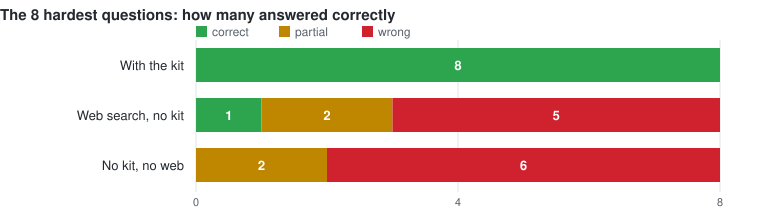

# Benchmark

Sixteen PowerWorld questions. The same AI model answered each one twice: once with this kit
on disk, once with nothing.

With the kit it got 16 right. Without it, 4 right, 6 half-right, 6 wrong.

The model without the kit never said "I don't know." It claimed confidence on all 16
questions and got 4 of them. Its six wrong answers were the kind PowerWorld accepts without
complaining:

- multiplied `Gen.TSH` by `GenMVABase`, which roughly doubles-to-triples system inertia on a
  large unit, because `TSH` is already on a 100 MVA base
- wrote to `BranchDeviceType`, which is a derived field, so the write does nothing
- sorted every violation by one percentage, which puts low-voltage violations in backwards
  order
- sent `SetData` a partial `LimitSet` row, which that object rejects
- hand-wrote `CONTINGENCY` blocks with labels PowerWorld would not have used

None of those raise an error. You get a number, it looks fine, and it is wrong. That is what
the 12-question gap is measuring.

---

## Would web search do the same job?

The kit is a file on your disk. PowerWorld's documentation is public. So a third run gave a
model web search and no kit, on the 8 questions the no-kit model had done worst on.

Web search fixed one of the eight. It found PowerWorld's own help pages on key fields and
required fields, and correctly explained that `CreateData` skips a branch when From Bus, To
Bus, Circuit ID, R, X, B or the ratings are missing. That behaviour is published, so search
found it.

The other seven it got wrong, and mostly got wrong *with citations*:

| Question | What web search said | What is true |
|---|---|---|
| sort violations worst-first | sort by Percent descending, per the help page | low-voltage violations sort backwards that way |
| build a contingency aux | hand-write `DATA (CTG, ...)` blocks, from two PowerWorld KB pages | hand-written labels do not match the ones PowerWorld generates |
| sum generator inertia | H times MVA base | `TSH` is already on a 100 MVA base; multiplying is wrong |
| convert lines to transformers | not possible outside the GUI | it is scriptable, via `LineXFMR` and `ChangeParametersMultipleElement` |
| tie-line violations disappearing | your area filter is set to require both ends | `AreaNum` reads `0` on a tie-line, so the filter drops it |

The last one is the clearest. Web search reasoned correctly about PowerWorld's documented
filter behaviour and still missed the cause, because the cause is a field returning zero and
nobody has published that.

### It also cost more

Web search took **8.6 minutes and 8.5 million tokens** to get 1 of 8. The kit took
**4.6 minutes and 5.8 million tokens** to get 8 of 8. Answering from memory alone took 2.8
minutes and 1.2 million tokens, and got none of them.

So the kit is not a convenience layer over public documentation. Most of what it knows was
found by running PowerWorld and watching it return a wrong answer quietly, and that does not
exist on the open web to be searched.

---

## Where the kit failed

Eight things were checked, each with a threshold written down and committed before any agent
ran. The kit passed seven and failed one.

| Check | Threshold | Result | |
|---|---|---:|:--|
| names the page it followed | 14 of 16 | 16 | pass |
| states the documented trap | 13 of 16 | 16 | pass |
| does not claim ignorance on something covered | at most 1 | 0 | pass |
| **says so when nothing covers the question** | **5 of 6** | **4** | **fail** |
| never cites a page that does not exist | 0 | 0 of 43 citations | pass |
| follows the kit's own code rules | 4 of 5 | 4 | pass |
| reads only the kit | 0 breaches | 0 of 38 agents | pass |
| beats the no-kit model | +5 of 16 | +12 | pass |

The failed check is the promise in `AGENTS.md` that the agent will say so when no page covers
a question. That promise had never been tested before this run.

It holds when the kit says nothing at all about a topic. All four questions on subjects the
kit does not mention were correctly answered "not covered."

It broke on a topic the kit mentioned without explaining. Asked whether `CTGSkip` or `Delete`
shrinks a contingency set, four agents split two right and two wrong. The two wrong ones
recommended `CTGSkip`, and one described the outcome as a shrunk set when nothing had been
removed.

The reason: `CTGSkip` appeared in three pages as a field being written, and nowhere with an
explanation of what it does. An agent searching for it found the word, assumed the topic was
covered, and stopped looking. A term the kit half-mentions is more dangerous than one it
never mentions, because it ends the search without answering anything.

`methods/reducing-a-contingency-set.md` was added and the same question re-run four times
against the published kit:

| | before | after |
|---|---:|---:|
| explains the mechanism correctly | 2 of 4 | 4 of 4 |
| recommends the right command | 1 of 4 | 4 of 4 |
| warns that it is destructive | 1 of 4 | 4 of 4 |
| gets the ordering right | 0 of 4 | 4 of 4 |

---

## The command reference

The kit lists about 198 PowerWorld SCRIPT commands, and 168 of them appear nowhere else in
it. A second run of 14 questions tested whether an agent actually reaches that list.

It does. Agents named the correct command on 6 of 7 questions whose answer lives only in
`references/`, and on all 3 questions about topics the kit declares out of scope they both
named the command and said the topic was out of scope.

They also found the ceiling. The command reference does not reproduce argument syntax, on
purpose, so an agent finds the right command and then reports it cannot write working code.
On three of the seven it named the correct command and still marked the question uncovered.
One described it as coverage at the level of which command exists, not how to use it.

One question defeated the kit entirely: "reduce this case to an equivalent." The command
`Equivalence` is in the list. No agent found it, because nobody searches for the word
"equivalence" when they want to reduce a case.

---

## What this does not tell you

- **One model, one attempt per question.** 16 questions in the first run, 14 in the second,
  8 in the web-search run. A threshold measured over 7 questions moves on a single answer.
- **No code was run against PowerWorld.** Code was checked against the documented traps —
  whether it would have failed quietly, not whether it executed.
- **The questions were drafted by a model from the same source the kit was built from, then
  reviewed by hand.** The review missed things. Five of 36 answer-key entries were wrong,
  and every one of those was an error in the key rather than in an agent's answer. Twice the
  agent was right and the key was wrong. Any benchmark whose answer key is written the same
  way the thing being tested works will have this problem, so it is stated here rather than
  left for someone else to find.
- **The kit failed its own threshold.** The specific defect is fixed and the fix is verified,
  but the check has not been re-run, because the question that failed is now covered and can
  no longer test whether the kit admits ignorance.

---

## Running it yourself

The bars, questions, answer key with its pre-run hash, all answers, and the scoring scripts
are kept outside this repository. The method matters more than the numbers:

1. Write the thresholds down and commit them before running anything. Do not adjust them
   afterwards.
2. Hash the answer key before the run and check the hash after, so the key provably did not
   move.
3. Run a control arm with no knowledge base. Without one you cannot tell whether the kit did
   anything.
4. Hide which arm produced which answer from whoever scores it.
5. Plant two fake answers in the scoring set: one correct but worded to avoid every keyword,
   one confidently backwards. If the scorer misses either, throw the scores out.
6. Test every check by feeding it something that should fail. A check that has only ever
   reported "clean" has not been tested.
