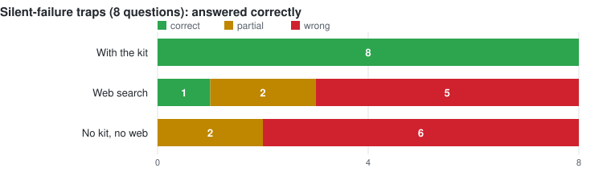
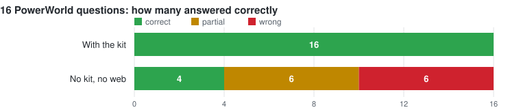
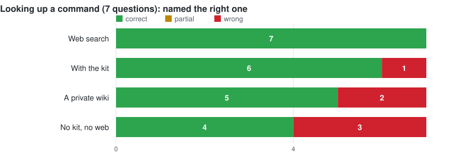
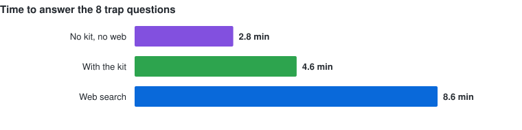

# Benchmark

**Short version: this kit is worth having for the traps and the boundary. For looking up a
command name, use PowerWorld's own documentation — a model with web search beat this kit at
that, 7 out of 7 against 6 out of 7.**

That is the honest result of 130 agent runs across four setups, with the thresholds written
down and committed before any of them started.

---

## What the kit is for

Thirty-seven questions, three of them about things nobody documents. The same model answered
each one under four conditions: with this kit, with a browser, with a large private wiki, and
with nothing at all.

The results split cleanly in two, and the split is the whole finding.

### Where the kit wins: the failures that do not raise an error



Eight questions about PowerWorld behaviour that produces a wrong answer quietly. The kit got
all eight. Web search got one. The model working from memory got none.

The one web search got right was `CreateData` silently skipping a branch when a key field is
missing — because PowerWorld publishes that. The seven it got wrong it got wrong *with
citations*:

| Question | What web search answered | What is actually true |
|---|---|---|
| tie-line violations vanish under an area filter | your filter is set to require both ends | `AreaNum` reads `0` on a tie-line, so the filter drops it |
| sum generator inertia | H times MVA base | `TSH` is already on a 100 MVA base; multiplying is wrong |
| convert lines to transformers | not possible outside the GUI | scriptable, via `LineXFMR` and `ChangeParametersMultipleElement` |
| sort violations worst-first | sort by Percent descending, per the help page | low-voltage violations sort backwards that way |
| build a contingency aux file | hand-write `DATA (CTG, ...)` blocks, from two KB pages | hand-written labels do not match the ones PowerWorld generates |

The last-but-one would have shipped a backwards priority list. The transformer one would have
stopped the work entirely by declaring the task impossible.

Over all 16 questions in that run, with the kit: 16 right. Without it: 4 right, 6 half-right,
6 wrong.



The model without the kit never once said it did not know. It reported confidence on all 16
and got 4.

### Where the kit loses: looking up a command



Seven questions whose answer is a PowerWorld SCRIPT command name. Web search got all seven.
The kit got six.

Worse for the kit, web search returned **argument syntax the kit deliberately withholds**:

```
SaveYbusInMatlabFormat("filename", IncludeVoltages)
RenumberBuses(NumCI)
WeatherPWWFileCombine2("source1", "source2", "destination")
WeatherPWWFileGeoReduce("source", "destination", minLat, maxLat, minLon, maxLon)
```

The kit's command reference lists names and purposes and points you at Simulator's own
*Auxiliary File Format* manual for syntax. That is a defensible choice — the manual is
PowerWorld's copyright — but it means an agent finds the right command and then reports it
cannot write working code. On three of the seven the kit named the correct command and still
marked the question uncovered.

**If your question is "what is this command called", the documentation is as good as this kit
and sometimes better. Use it.**

---

## The other thing the kit does: stop

Ten questions had no answer available in the kit. The correct response is to say so.

| | said "I don't cover this" |
|---|---|
| **the kit** | **8 of 10** |
| a large private wiki | 4 of 4 where tested |
| web search | 1 of 10 |
| no kit, no web | 0 of 10 |

Neither the bare model nor web search ever declined. Asked how to size a transformer against
the flow it will carry — a question with a real trap in it, since the transformer's own
impedance changes that flow — web search produced a confident methodology assembled from
HVAC-vendor blog posts.

**But read this next part before treating that as a straight win.** Three of those ten
questions (topology processing, scheduled actions, fault studies) *are* documented by
PowerWorld in public. Web search returned complete, correctly-sourced procedures for all
three, including that integrated topology processing needs a separately licensed add-on. On
those, the kit said "I don't cover this" while a user with a browser got a real answer.

So the kit's boundary is honest, and honesty is not the same as usefulness. It declines
correctly. It also declines on things you could have looked up.

---

## What it costs




On the eight trap questions: the kit took 4.6 minutes and 5.8 million tokens for 8 right. Web
search took 8.6 minutes and 8.5 million tokens for 1. Working from memory took 2.8 minutes
and 1.2 million tokens for 0.

The kit is roughly twice the time and ten times the cache reads of answering from memory.
Whether 16 out of 16 is worth 34 seconds instead of 18 is your call, and you now have the
numbers to make it.

---

## Where the kit failed its own threshold

Eight checks, all written down before the run. Seven passed.

| Check | Threshold | Result | |
|---|---|---:|:--|
| names the page it followed | 14 of 16 | 16 | pass |
| states the documented trap | 13 of 16 | 16 | pass |
| does not claim ignorance on something covered | at most 1 | 0 | pass |
| **says so when nothing covers the question** | **5 of 6** | **4** | **fail** |
| never cites a page that does not exist | 0 | 0 of 43 citations | pass |
| follows the kit's own code rules | 4 of 5 | 4 | pass |
| reads only the kit | 0 breaches | 0 of 38 agents | pass |
| beats the no-kit model | +5 of 16 | +12 | pass |

The failure: asked whether `CTGSkip` or `Delete` shrinks a contingency set, four agents split
two right and two wrong. `CTGSkip` appeared in three pages as a field being written and
nowhere with an explanation of what it does, so an agent found the word, assumed the topic was
covered, and stopped searching.

A term the kit half-mentions is worse than one it never mentions: it ends the search without
answering anything.

Fixed by adding `methods/reducing-a-contingency-set.md`, then re-run four times against the
published kit:

| | before | after |
|---|---:|---:|
| explains the mechanism correctly | 2 of 4 | 4 of 4 |
| recommends the right command | 1 of 4 | 4 of 4 |
| warns that it is destructive | 1 of 4 | 4 of 4 |
| gets the ordering right | 0 of 4 | 4 of 4 |

---

## What this does not tell you

- **One model, one attempt per question.** Between 4 and 16 questions per measurement. A
  number based on 7 questions moves on a single answer.
- **No code was run against PowerWorld.** Code was checked against the documented traps —
  whether it would have failed quietly, not whether it executed.
- **The answer key had errors, and they all pointed the same way.** Five entries were wrong,
  a results extractor silently replaced 57 of 130 answers with placeholder text, and two more
  scoring keys missed commands the answers plainly contained. **Every one of those flattered
  this kit**, and each was caught only by reading an answer that contradicted its own score.
  The first published version of this page reported web search at 1 of 8 without mentioning it
  had beaten the kit 7 to 6 on command lookup. That was wrong and this version corrects it.
- **The kit failed its own threshold**, and the check has not been re-run, because the
  question that failed is now covered and can no longer test whether the kit admits ignorance.

---

## Running it yourself

The thresholds, questions, answer key with its pre-run hash, all answers and the scoring
scripts are kept outside this repository. The method matters more than the numbers:

1. Write the thresholds down and commit them before running anything. Do not adjust them
   afterwards.
2. Hash the answer key before the run, check it after.
3. Run a control with no knowledge base. Without one you cannot tell whether the kit did
   anything.
4. Hide which setup produced which answer from whoever scores it.
5. Plant two fake answers in the scoring set: one correct but avoiding every keyword, one
   confidently backwards. If the scorer misses either, throw the scores out.
6. Test every check by feeding it something that should fail. A check that has only ever
   reported "clean" has not been tested.
7. **Read the answers.** Every error in this benchmark was caught by a human-legible answer
   disagreeing with a machine-generated score, and never the other way round.
