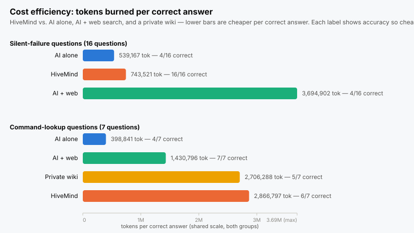

# Benchmark

If you are about to drive PowerWorld from Python with an AI assistant, this page tells you what
PowerWorldHiveMind changes, what it does not, and what it costs.

**It is decisive on the things PowerWorld gets wrong quietly. It is the worst of the three
for looking up a command name — slower, more expensive and less accurate than a web search.**

## What was compared

The same AI model answered the same questions three ways:

| Setup | What that means |
|---|---|
| **HiveMind** | the assistant has this repository on disk, and nothing else |
| **AI alone** | a fresh assistant, as if you opened ChatGPT or Claude and asked without teaching it anything about PowerWorld first |
| **AI + web** | the same fresh assistant, still knowing nothing about PowerWorld, but free to search the open web and read PowerWorld's public documentation |

108 runs across 36 questions. Every threshold was written down and committed before any of them
started.


---

## 1. Questions where PowerWorld lies to you

Simulator accepts the call, reports success, and returns something wrong. Nothing raises an
error. These are the ones that cost you a day.

| Q | The question | HiveMind | AI alone | AI + web |
|---|---|:--:|:--:|:--:|
| A01 | Saved the case, no file appeared | ✅ | ✅ | ❌ |
| A02 | Set MW on just the coal units | ✅ | ✅ | ⚠️ |
| A03 | DC solve says balanced, generation is short | ✅ | ✅ | ✅ |
| A04 | Created lines, nothing was created | ✅ | ⚠️ | ✅ |
| A05 | Setting the N-1 voltage limits | ✅ | ❌ | ⚠️ |
| A06 | Which contingency caused which overload | ✅ | ⚠️ | ✅ |
| A07 | Area filter hid every tie-line violation | ✅ | ⚠️ | ❌ |
| A08 | Violations from a case never solved | ✅ | ✅ | ✅ |
| A09 | Sorting violations worst-first | ✅ | ❌ | ❌ |
| A10 | One contingency per new generator | ✅ | ❌ | ❌ |
| A11 | Total system inertia | ✅ | ❌ | ❌ |
| A12 | Reclassifying lines as transformers | ✅ | ❌ | ⚠️ |
| A13 | Prerequisites for hourly wind and solar | ✅ | ⚠️ | ⚠️ |
| A14 | Capacity factor from timestep output | ✅ | ❌ | ❌ |
| A15 | Solves in DC, trust it for AC? | ✅ | ⚠️ | ⚠️ |
| A16 | Speeding up a two-hour contingency run | ✅ | ⚠️ | ❌ |
| | **right / partial / wrong** | **16 / 0 / 0** | 4 / 6 / 6 | 4 / 5 / 7 |

✅ right · ⚠️ partly right · ❌ wrong

**Searching scored the same as not searching** — four right either way. The search did not come
up empty. It found PowerWorld's own help pages, cited them, and was wrong:

| Q | What the search-backed answer said | What actually happens |
|---|---|---|
| A07 | your filter is set to require both ends | `AreaNum` reads `0` on a tie-line, so the filter drops it |
| A11 | H times MVA base | `TSH` is already on a 100 MVA base — multiplying overstates a large unit several times over |
| A12 | not possible outside the GUI | it is scriptable, via `LineXFMR` and `ChangeParametersMultipleElement` |
| A09 | sort by Percent descending, per the help page | that puts low-voltage violations in backwards order |
| A16 | buy the distributed-computing add-on | it never spawns workers here and silently runs single-process |
| A01 | a relative path or a missing overwrite flag | the COM save call reports success and writes nothing |

A09 hands you a backwards priority list. A12 stops the work by declaring it impossible. A16
sends you to purchase an add-on that reports success and does nothing.

AI alone never once said "I don't know." Confident on all sixteen, right on four.

---

## 2. Looking up a command: use PowerWorld's manual

| Q | The question | HiveMind | AI alone | AI + web |
|---|---|:--:|:--:|:--:|
| R1 | Run a security-constrained OPF | ✅ | ✅ | ✅ |
| R2 | Export the Ybus for MATLAB | ✅ | ✅ | ✅ |
| R3 | Renumber the buses | ✅ | ❌ | ✅ |
| R4 | Built-in LODF screening | ✅ | ❌ | ✅ |
| R5 | Combine and crop weather files | ✅ | ❌ | ✅ |
| R6 | Set participation factors | ✅ | ✅ | ✅ |
| R7 | Reduce a case to an equivalent | ❌ | ✅ | ✅ |
| | **named the right command** | 6 / 7 | 4 / 7 | **7 / 7** |

Search also returned argument syntax this repository deliberately does not publish, because the
*Auxiliary File Format* manual is PowerWorld's copyright:

```
SaveYbusInMatlabFormat("filename", IncludeVoltages)
RenumberBuses(NumCI)
WeatherPWWFileCombine2("source1", "source2", "destination")
WeatherPWWFileGeoReduce("source", "destination", minLat, maxLat, minLon, maxLon)
```

On three of these seven, HiveMind named the correct command and still reported the question
uncovered, because it could not give you a signature to call it with.

**If your question is "what is this command called", open the manual.**

---

## 3. Topics this repository says are out of scope

`AGENTS.md` states that PV/QV curve studies and transient-stability theory are not covered.
The command reference lists the commands for them anyway. The best answer gives you both: the
command, and a warning that the methodology is not here.

| Q | The question | HiveMind | AI alone | AI + web |
|---|---|:--:|:--:|:--:|
| T1 | Run a PV nose curve | ✅ both | ❌ | ❌ |
| T2 | Critical clearing time | ✅ both | ❌ | ❌ |
| T3 | Run a QV study at a bus | ✅ both | ❌ | ❌ |

---

## 4. Questions with no answer here at all

Ten questions had no answer in this repository. Saying so is the correct response.

| Q | The question | HiveMind | AI alone | AI + web |
|---|---|:--:|:--:|:--:|
| X01 | Transformer taps to fix high bus voltage | ✅ declined | ❌ answered | ❌ answered |
| X02 | Conductor thermal rating from weather | ✅ declined | ❌ answered | ❌ answered |
| X03 | `CTGSkip` or `Delete` to shrink a set | ❌ answered | ❌ answered | ❌ answered |
| X04 | Screen which branches matter | — void, see below | ❌ answered | ❌ answered |
| X05 | Size a new transformer | ✅ declined | ❌ answered | ❌ answered |
| X06 | Match a fleet to EIA-860 | ✅ declined | ❌ answered | ❌ answered |
| N1 | Available transfer capability | ✅ declined | ❌ answered | ✅ declined |
| N2 | Integrated topology processing | ✅ declined | ❌ answered | 🔵 answered from public docs |
| N3 | Schedule an action mid-run | ✅ declined | ❌ answered | 🔵 answered from public docs |
| N4 | Short-circuit fault study | ✅ declined | ❌ answered | 🔵 answered from public docs |
| | **declined** | **8 of 10** | 0 of 10 | 1 of 10 |

🔵 **N2, N3 and N4 are documented publicly**, and the search returned correct, sourced
procedures for all three — including that integrated topology processing needs a separately
licensed add-on. On those, HiveMind said "I don't cover this" while a browser would have
answered you. Five of its eight refusals are the behaviour you want; three are not.

**X04 is void** — the question assumed this repository could not screen branches. It can, via
`concepts/lodf.md`. The answer key was wrong, not the answer.

Asked how to size a transformer against the flow it will carry — a question with a real trap in
it, since the transformer's own impedance changes that flow — the search-backed answer produced
a confident methodology assembled from HVAC-vendor blog posts.


---

## 5. What each question cost

Accuracy and cost do not sit on the same axis. The cheapest setup scores zero, and the most
expensive one is not the most accurate:


Tokens read, and number of searches, per question. "Tokens read" is input plus cache writes
plus cache reads — everything the model had to process.

| Q | The question | HiveMind | AI alone | AI + web |
|---|---|---:|---:|---:|
| A01 | Saved the case, no file appeared | 204k / 1 | 129k / 0 | 1.01M / 8 |
| A02 | Set MW on just the coal units | **1.44M / 9** | 129k / 0 | 702k / 5 |
| A03 | DC solve says balanced, generation short | 205k / 1 | 129k / 0 | 632k / 5 |
| A04 | Created lines, nothing was created | 515k / 3 | 129k / 0 | 861k / 7 |
| A05 | Setting the N-1 voltage limits | 754k / 5 | 129k / 0 | 1.58M / 12 |
| A06 | Which contingency caused which overload | 513k / 4 | 129k / 0 | 926k / 7 |
| A07 | Area filter hid every tie-line violation | 782k / 6 | 65k / 0 | 1.32M / 11 |
| A08 | Violations from a case never solved | 855k / 6 | 129k / 0 | 633k / 4 |
| A09 | Sorting violations worst-first | 942k / 6 | 129k / 0 | 861k / 7 |
| A10 | One contingency per new generator | 857k / 5 | 345k / 2 | 1.08M / 8 |
| A11 | Total system inertia | 801k / 6 | 129k / 0 | 783k / 6 |
| A12 | Reclassifying lines as transformers | 602k / 4 | 129k / 0 | 1.32M / 11 |
| A13 | Prerequisites for hourly wind and solar | 644k / 5 | 129k / 0 | 1.01M / 8 |
| A14 | Capacity factor from timestep output | 557k / 4 | 129k / 0 | 707k / 5 |
| A15 | Solves in DC, trust it for AC? | **1.30M / 9** | 65k / 0 | 560k / 4 |
| A16 | Speeding up a two-hour contingency run | 922k / 6 | 129k / 0 | 781k / 6 |
| | **total** | **11.90M / 80** | 2.16M / 2 | 14.78M / 114 |

**HiveMind is cheaper than searching on average and more expensive on 5 of the 16.** A02 cost
2.1× what the search cost; A15 cost 2.3×. When the search across these pages goes wide, this
repository is the expensive option. Per-question it ranges from 204k to 1.44M tokens, depending
entirely on how fast it finds the right page.

And on command lookup it is the most expensive of all four:

| Q | HiveMind | AI alone | AI + web |
|---|---:|---:|---:|
| R1 | 1.74M / 13 | 65k / 0 | 1.36M / 11 |
| R2 | 1.43M / 11 | 346k / 2 | 863k / 7 |
| R3 | 1.48M / 11 | 65k / 0 | 707k / 5 |
| R4 | 1.38M / 10 | 65k / 0 | 487k / 4 |
| R5 | 942k / 6 | 130k / 0 | 1.17M / 9 |
| R6 | 1.09M / 7 | 65k / 0 | 706k / 6 |
| R7 | 1.31M / 8 | 65k / 0 | 1.09M / 9 |
| | **9.37M / 66** | 801k / 2 | **6.38M / 51** |

---

## 6. Context efficiency

Every search re-reads the conversation so far. That re-read is where the tokens go, and it
costs about the same no matter which setup you use:

| Group | Setup | Searches | Context re-read | **Per search** |
|---|---|---:|---:|---:|
| Silent failures | HiveMind | 80 | 10.27M | **128k** |
| Silent failures | AI + web | 114 | 13.15M | **115k** |
| Command lookup | HiveMind | 118 | 15.63M | **132k** |
| Command lookup | AI + web | 76 | 8.78M | **115k** |
| No answer here | HiveMind | 36 | 5.09M | **141k** |
| No answer here | AI + web | 27 | 3.31M | **123k** |

**Between 115k and 141k tokens per search, across every setup and every question group.** Your cost is set by *how many
times the assistant has to look*, not by how much it reads when it gets there. A knowledge base
that answers in one search is cheap; one that needs nine is not, regardless of page length.

That is why A03 cost 205k with HiveMind (one search, straight to the page) and A02 cost 1.44M
(nine searches, hunting).

### Tokens per correct answer



| Group | Setup | Correct | Tokens per correct answer |
|---|---|:--:|---:|
| Silent failures | AI alone | 4 of 16 | 539k |
| Silent failures | **HiveMind** | **16 of 16** | **744k** |
| Silent failures | AI + web | 4 of 16 | 3.69M |
| Command lookup | AI alone | 4 of 7 | 399k |
| Command lookup | AI + web | 7 of 7 | 1.43M |
| Command lookup | **HiveMind** | 6 of 7 | **2.87M** |

**Read cheapness carefully.** AI alone is cheapest in both groups because it barely tried — two
searches across sixteen questions — not because it is efficient. It got 4 of 16.

On silent failures HiveMind costs 38% more per answer than guessing and gets four times as many
right, while searching costs five times more for the same four. On command lookup HiveMind is
the most expensive per correct answer of the three.

Median wall-clock per question: **18 s** answering from memory, **34 s** with HiveMind, and
**62 s** searching.

---

## 7. Where HiveMind failed its own threshold

Eight checks, all registered before the run. Seven passed.

| Check | Threshold | Result | |
|---|---|---:|:--|
| names the page it followed | 14 of 16 | 16 | pass |
| states the documented trap | 13 of 16 | 16 | pass |
| does not claim ignorance on something covered | at most 1 | 0 | pass |
| **says so when nothing covers the question** | **5 of 6** | **4** | **fail** |
| never cites a page that does not exist | 0 | 0 of 43 citations | pass |
| follows its own code rules | 4 of 5 | 4 | pass |
| reads only this repository | 0 breaches | 0 of 38 runs | pass |
| beats the no-documentation baseline | +5 of 16 | +12 | pass |

The failure is X03. Asked whether `CTGSkip` or `Delete` shrinks a contingency set, four runs
split two right and two wrong. `CTGSkip` appeared in three pages as a field being written, and
nowhere with an explanation of what it does — so the search found the word, assumed the topic
was covered, and stopped.

A term half-mentioned is worse than one never mentioned: it ends the search without answering
anything.

Fixed by adding `methods/reducing-a-contingency-set.md`, then re-run four times:

| | before | after |
|---|---:|---:|
| explains the mechanism correctly | 2 of 4 | 4 of 4 |
| recommends the right command | 1 of 4 | 4 of 4 |
| warns that it is destructive | 1 of 4 | 4 of 4 |
| gets the ordering right | 0 of 4 | 4 of 4 |

---

## What this does not tell you

- **One model, one attempt per question.** Between 3 and 16 questions per measurement. A number
  based on 7 questions moves on a single answer.
- **No code was run against PowerWorld.** Code was judged on whether it would have failed
  quietly, not on whether it executed.
- **Token figures are one run each**, not averages over repeats. Treat them as the right order
  of magnitude, not to three digits.
- **The answer key had errors, and every one flattered this repository.** Five key entries were
  wrong. A results extractor silently replaced 57 of 130 answers with placeholder text,
  deflating both non-HiveMind setups. Two scoring keys missed commands the answers plainly
  contained. An earlier version of this page reported search at 1 of 8 and did not mention it
  had beaten HiveMind at command lookup. Each was caught by reading an answer that contradicted
  its own score — never by a script.
- **The failed check has not been re-run**, because the question that failed is now covered and
  can no longer test whether HiveMind admits ignorance.

---

## Running it yourself

Thresholds, questions, the answer key with its pre-run hash, all 130 answers and the scoring
scripts are kept outside this repository. The method matters more than the numbers:

1. Write the thresholds down and commit them before running anything. Do not adjust them
   afterwards.
2. Hash the answer key before the run, check it after.
3. Run a baseline with no documentation at all. Without one you cannot tell whether the
   documentation did anything.
4. Hide which setup produced which answer from whoever scores it.
5. Plant two fake answers in the scoring set: one correct but avoiding every keyword, one
   confidently backwards. If the scorer misses either, throw the scores out.
6. Test every check by feeding it something that should fail. A check that has only ever
   reported "clean" has not been tested.
7. **Read the answers.** Every error found here came from a human-legible answer disagreeing
   with a machine-generated score, and never the other way round.
