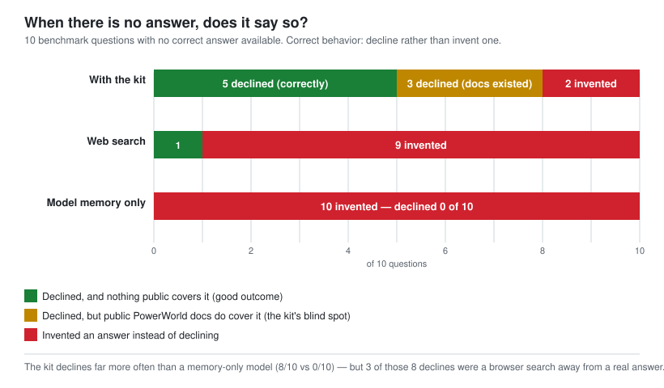
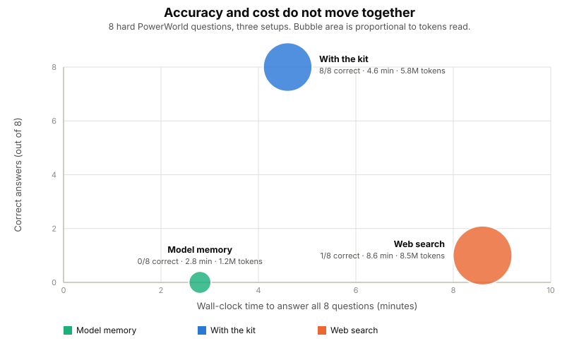

# Benchmark

If you are about to drive PowerWorld from Python with an AI assistant, this page tells you
what PowerWorldHiveMind changes and what it does not.

**It changes a lot on the things PowerWorld gets wrong quietly, and nothing at all on looking
up a command name.** Details below, per question, with the cost.

## What was compared

The same AI model answered the same questions four ways:

| Setup | What it had |
|---|---|
| **HiveMind** | this repository on disk, nothing else |
| **AI alone** | no documentation at all, answering from what the model already knew |
| **AI + web** | no repository, but a search engine and PowerWorld's public documentation |
| **A private wiki** | a much larger internal PowerWorld knowledge base, for reference |

130 runs. Every threshold was written down and committed before any of them started.


---

## The questions where PowerWorld lies to you

These are the ones that cost you a day. PowerWorld accepts the call, reports success, and
returns something wrong. Nothing raises an error.

| Q | The question | HiveMind | AI alone | AI + web |
|---|---|:--:|:--:|:--:|
| A01 | Saved the case, no file appeared | ✅ | ✅ | ❌ |
| A02 | Set MW on just the coal units | ✅ | ✅ | ⚠️ |
| A03 | DC solve says balanced, but generation is short | ✅ | ✅ | ✅ |
| A04 | Created lines, nothing was created | ✅ | ⚠️ | ✅ |
| A05 | Setting the N-1 voltage limits | ✅ | ❌ | ⚠️ |
| A06 | Which contingency caused which overload | ✅ | ⚠️ | ✅ |
| A07 | Area filter hid every tie-line violation | ✅ | ⚠️ | ❌ |
| A08 | Violations read back from a case never solved | ✅ | ✅ | ✅ |
| A09 | Sorting violations worst-first | ✅ | ❌ | ❌ |
| A10 | One contingency per new generator | ✅ | ❌ | ❌ |
| A11 | Total system inertia | ✅ | ❌ | ❌ |
| A12 | Reclassifying lines as transformers | ✅ | ❌ | ⚠️ |
| A13 | What a case needs for hourly wind and solar | ✅ | ⚠️ | ⚠️ |
| A14 | Capacity factor from timestep output | ✅ | ❌ | ❌ |
| A15 | Case solves in DC — trust it for AC? | ✅ | ⚠️ | ⚠️ |
| A16 | Speeding up a two-hour contingency run | ✅ | ⚠️ | ❌ |
| | **right / partial / wrong** | **16 / 0 / 0** | 4 / 6 / 6 | 4 / 5 / 7 |

✅ right · ⚠️ partly right · ❌ wrong

**Searching scored the same as not searching.** Four right either way. The search did not come
up empty — it found PowerWorld's own help pages, cited them, and still got these wrong:

| Question | What the search-backed answer said | What actually happens |
|---|---|---|
| A07 tie-lines | your filter is set to require both ends | `AreaNum` reads `0` on a tie-line, so the filter drops it |
| A11 inertia | H times MVA base | `TSH` is already on a 100 MVA base — multiplying overstates a large unit several times over |
| A12 transformers | not possible outside the GUI | it is scriptable, via `LineXFMR` and `ChangeParametersMultipleElement` |
| A09 sorting | sort by Percent descending, per the help page | that puts low-voltage violations in backwards order |
| A16 speed | buy the distributed-computing add-on | it never spawns workers here and silently runs single-process |

A09 hands you a backwards priority list. A12 stops the work by declaring it impossible. A16
sends you to purchase an add-on that reports success and does nothing.

Answering from memory alone never once said "I don't know." It was confident on all sixteen
and right on four.

---

## Looking up a command: use PowerWorld's manual instead

| Q | The question | HiveMind | A private wiki | AI alone | AI + web |
|---|---|:--:|:--:|:--:|:--:|
| R1 | Run a security-constrained OPF | ✅ | ✅ | ✅ | ✅ |
| R2 | Export the Ybus for MATLAB | ✅ | ✅ | ✅ | ✅ |
| R3 | Renumber the buses | ✅ | ✅ | ❌ | ✅ |
| R4 | Built-in LODF screening | ✅ | ❌ | ❌ | ✅ |
| R5 | Combine and crop weather files | ✅ | ✅ | ❌ | ✅ |
| R6 | Set participation factors | ✅ | ✅ | ✅ | ✅ |
| R7 | Reduce a case to an equivalent | ❌ | ❌ | ✅ | ✅ |
| | **named the right command** | 6 / 7 | 5 / 7 | 4 / 7 | **7 / 7** |

Search also returned argument syntax this repository deliberately does not publish, because
the *Auxiliary File Format* manual is PowerWorld's copyright:

```
SaveYbusInMatlabFormat("filename", IncludeVoltages)
RenumberBuses(NumCI)
WeatherPWWFileCombine2("source1", "source2", "destination")
WeatherPWWFileGeoReduce("source", "destination", minLat, maxLat, minLon, maxLon)
```

On three of these seven, HiveMind named the correct command and still reported the question
uncovered, because it could not give you a signature to call it with.

**If your question is "what is this command called", open the manual. This repository adds
nothing there.**

---

## Knowing when to stop



Ten questions had no answer in this repository. Saying so is the correct response.

| | said "I cannot answer this" |
|---|---:|
| **HiveMind** | **8 of 10** |
| AI + web | 1 of 10 |
| AI alone | 0 of 10 |

Asked how to size a transformer against the flow it will carry — a question with a real trap
in it, since the transformer's own impedance changes that flow — the search-backed answer
produced a confident methodology assembled from HVAC-vendor blog posts.

**The catch, shown in the chart rather than hidden in a footnote:** three of those ten topics
*are* documented publicly, and search answered all three correctly. So five of HiveMind's eight
refusals are the behaviour you want, and three are it refusing something you could have looked
up.

---

## What it costs



Total tokens read across all sixteen questions:

| | tokens | vs HiveMind |
|---|---:|---:|
| AI alone | 2.2 M | 0.18× |
| **HiveMind** | **11.9 M** | 1.00× |
| AI + web | 14.8 M | 1.24× |

**The average hides something you should know before budgeting.** HiveMind is cheaper than
searching on average, but **on 5 of the 16 questions it cost more**:

| Q | HiveMind | AI + web | |
|---|---:|---:|---|
| A02 set MW on coal units | **1,441,683** | 701,552 | HiveMind cost 2.1× more |
| A15 trust DC for AC | **1,302,504** | 560,408 | 2.3× more |
| A08 stale violations | **854,547** | 633,144 | 1.3× more |
| A09 sorting violations | **942,303** | 861,413 | 1.1× more |
| A16 speeding up a run | **921,833** | 781,196 | 1.2× more |

When the search across these pages goes wide, HiveMind is the expensive option. It reads
between 200,000 and 1.4 million tokens per question depending on how quickly it finds the
right page. Searching the web ran 4 to 12 tool calls per question; answering from memory ran
none.

Wall-clock, median per question: 34 s with HiveMind, 18 s from memory, 62 s searching.

---

## Where HiveMind failed its own threshold

Eight checks, all registered before the run. Seven passed.

| Check | Threshold | Result | |
|---|---|---:|:--|
| names the page it followed | 14 of 16 | 16 | pass |
| states the documented trap | 13 of 16 | 16 | pass |
| does not claim ignorance on something covered | at most 1 | 0 | pass |
| **says so when nothing covers the question** | **5 of 6** | **4** | **fail** |
| never cites a page that does not exist | 0 | 0 of 43 citations | pass |
| follows its own code rules | 4 of 5 | 4 | pass |
| reads only this repository | 0 breaches | 0 of 38 runs | pass |
| beats the no-documentation baseline | +5 of 16 | +12 | pass |

The failure: asked whether `CTGSkip` or `Delete` shrinks a contingency set, four runs split two
right and two wrong. `CTGSkip` appeared in three pages as a field being written, and nowhere
with an explanation of what it does — so the search found the word, assumed the topic was
covered, and stopped.

A term half-mentioned is worse than one never mentioned: it ends the search without answering
anything.

Fixed by adding `methods/reducing-a-contingency-set.md`, then re-run four times:

| | before | after |
|---|---:|---:|
| explains the mechanism correctly | 2 of 4 | 4 of 4 |
| recommends the right command | 1 of 4 | 4 of 4 |
| warns that it is destructive | 1 of 4 | 4 of 4 |
| gets the ordering right | 0 of 4 | 4 of 4 |

---

## What this does not tell you

- **One model, one attempt per question.** Between 4 and 16 questions per measurement. A
  number based on 7 questions moves on a single answer.
- **No code was run against PowerWorld.** Code was judged on whether it would have failed
  quietly, not on whether it executed.
- **The answer key had errors, and every one flattered this repository.** Five key entries were
  wrong. A results extractor silently replaced 57 of 130 answers with placeholder text,
  deflating both non-HiveMind setups. Two scoring keys missed commands the answers plainly
  contained. An earlier version of this page reported search at 1 of 8 and did not mention it
  had beaten HiveMind at command lookup. Each error was caught by reading an answer that
  contradicted its own score — never by a script.
- **The failed check has not been re-run**, because the question that failed is now covered and
  can no longer test whether HiveMind admits ignorance.

---

## Running it yourself

Thresholds, questions, the answer key with its pre-run hash, all 130 answers and the scoring
scripts are kept outside this repository. The method matters more than the numbers:

1. Write the thresholds down and commit them before running anything. Do not adjust them
   afterwards.
2. Hash the answer key before the run, check it after.
3. Run a baseline with no documentation at all. Without one you cannot tell whether the
   documentation did anything.
4. Hide which setup produced which answer from whoever scores it.
5. Plant two fake answers in the scoring set: one correct but avoiding every keyword, one
   confidently backwards. If the scorer misses either, throw the scores out.
6. Test every check by feeding it something that should fail. A check that has only ever
   reported "clean" has not been tested.
7. **Read the answers.** Every error found here came from a human-legible answer disagreeing
   with a machine-generated score, and never the other way round.
