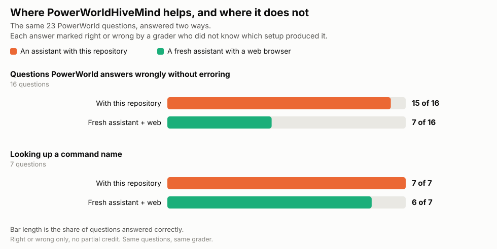
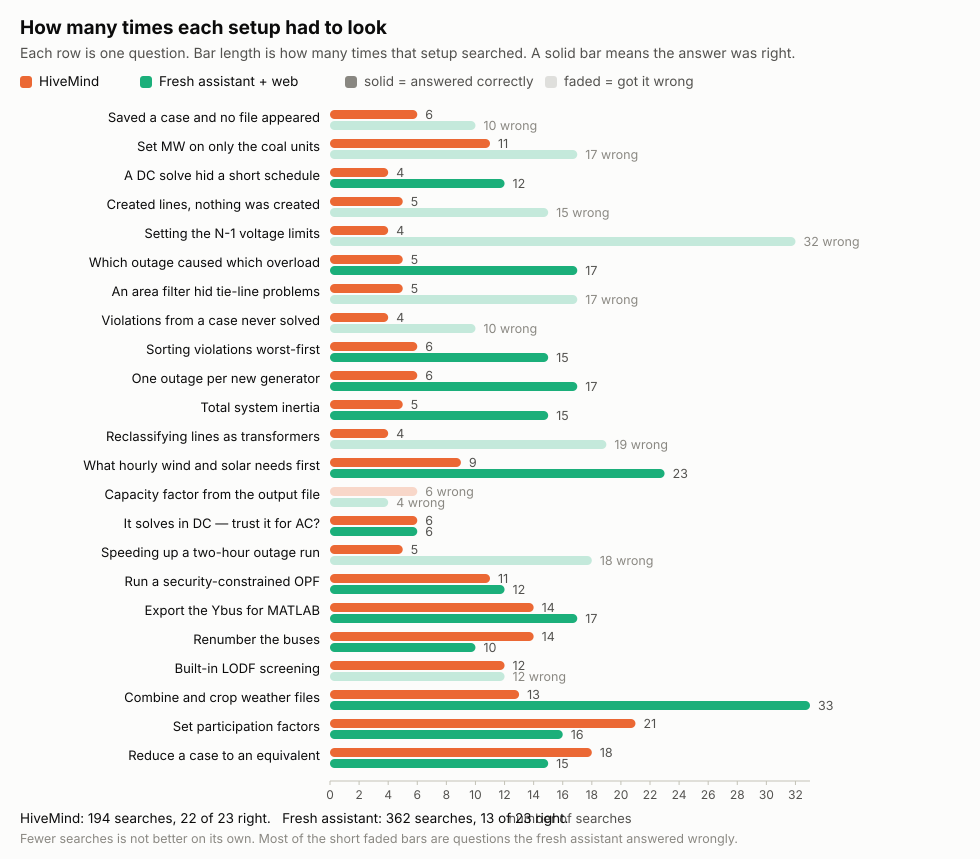

# Benchmark — PowerWorldHiveMind v0.4.0

If you are about to drive PowerWorld from Python with an AI assistant, this page tells you
what PowerWorldHiveMind changes, what it does not, and what it costs.

Measured against release **v0.4.0**. Later releases are benchmarked the same way, so the
numbers below can be compared across versions.

**It solved 22 of 23 questions against 13 for a capable assistant with a web
browser.** The gap is almost entirely in one place: **15 of 16** against
**7 of 16** on the failures PowerWorld does not report as failures.
On looking up a command it also leads, 7 of 7 against 6.

## What was compared

| Setup | What that means |
|---|---|
| **HiveMind** | the assistant has this repository on disk, and nothing else |
| **A fresh assistant + web** | a capable coding assistant told nothing about PowerWorld, with no documentation and no files, free to search the open web |

Both answered the same 23 questions. Every answer was then marked right or wrong
by a grader that saw a reference answer and the candidates **without knowing which setup
wrote which**. Two answers were planted in the pile to test the grader: one correct but
worded to avoid every obvious keyword, one fluent and confidently backwards. It caught
both. Had it missed either, every score here would have been thrown away.

**Compare the HiveMind column across versions, not the web column.** Before v0.4.0 the web
setup was given web search but never allowed to use it: every search was blocked, so the
earlier "6 of 23 with a web browser" was the same model with no tools at all.

**Right or wrong only — there is no partial credit.** An earlier version of this benchmark
used a three-level scale, and the middle level is where two of five scoring errors hid: a
wrong answer marked *partly right* reads as a judgement call rather than a mistake, so
nobody re-checks it.

---

## 1. Questions where PowerWorld lies to you

Simulator accepts the call, reports success, and returns something wrong. Nothing raises an
error. These are the ones that cost you a day.

| Q | The question | HiveMind | Fresh assistant + web |
|---|---|:--:|:--:|
| A01 | Saved a case and no file appeared | ✅ | ❌ |
| A02 | Set MW on only the coal units | ✅ | ❌ |
| A03 | A DC solve hid a short schedule | ✅ | ✅ |
| A04 | Created lines, nothing was created | ✅ | ❌ |
| A05 | Setting the N-1 voltage limits | ✅ | ❌ |
| A06 | Which outage caused which overload | ✅ | ✅ |
| A07 | An area filter hid tie-line problems | ✅ | ❌ |
| A08 | Violations from a case never solved | ✅ | ❌ |
| A09 | Sorting violations worst-first | ✅ | ✅ |
| A10 | One outage per new generator | ✅ | ✅ |
| A11 | Total system inertia | ✅ | ✅ |
| A12 | Reclassifying lines as transformers | ✅ | ❌ |
| A13 | What hourly wind and solar needs first | ✅ | ✅ |
| A14 | Capacity factor from the output file | ❌ | ❌ |
| A15 | It solves in DC — trust it for AC? | ✅ | ✅ |
| A16 | Speeding up a two-hour outage run | ✅ | ❌ |
| | **solved** | **15 of 16** | 7 of 16 |

**This is what the repository is for.** A fresh assistant with the whole open web could
confirm 7 of these 16. Public documentation describes what a command
does; it does not tell you that the call returns success and writes nothing, or that a
filter silently drops every tie-line, or that a field you are summing is already on a
different base than you think.

**A14 defeated both setups.** Where neither the repository nor the open
web gets there, the question is worth reading rather than scoring.

---

## 2. Looking up a command

| Q | The question | HiveMind | Fresh assistant + web |
|---|---|:--:|:--:|
| R1 | Run a security-constrained OPF | ✅ | ✅ |
| R2 | Export the Ybus for MATLAB | ✅ | ✅ |
| R3 | Renumber the buses | ✅ | ✅ |
| R4 | Built-in LODF screening | ✅ | ❌ |
| R5 | Combine and crop weather files | ✅ | ✅ |
| R6 | Set participation factors | ✅ | ✅ |
| R7 | Reduce a case to an equivalent | ✅ | ✅ |
| | **solved** | **7 of 7** | 6 of 7 |

HiveMind gets 7 of 7 against 6 for the web, and spends **103 searches** doing it against 115.

---

## 3. What it costs

**Cost here is counted in searches, not tokens.** A search means the same thing in both
setups: the assistant did not know, and went to look. A token does not — the setups read
different amounts of conversation per step, and separately, in an earlier run, the same corpus
searched 8.1 times per question when asked an ordinary question and 14.3 times when asked
for the best answer it could give. One sentence of instruction moved cost by 1.8x.
**Ranking setups by tokens partly ranks the instructions they happened to be given.**

| | Solved | Searches | **Searches per question solved** |
|---|:--:|--:|--:|
| **HiveMind** | **22 of 23** | 194 | **8.8** |
| Fresh assistant + web | 13 of 23 | 362 | 27.8 |

HiveMind searches less in total (194 against 362) and still solves more, so each right
answer takes 3.2x fewer searches.

Median wall-clock per question: **58 s** with HiveMind, **147 s** for the fresh
assistant searching the web.

---

## 4. The case-auditor agent

Sections 1–3 test the kit as a reference. This one tests an agent: the **case-auditor**, which
reads a case, decides whether it can run base, N-1, time step, OPF or SCOPF, and says what
stops each study.

**Both setups get the same audit output.** The kit's audit engine ran on two public synthetic
cases, Hawaii40 and Texas2k. Six more cases were seeded from Hawaii40 with known defects: a case
that does not solve, a DC-only skeleton, a generator a little over its rating and one far over it,
OPF areas with no cost data, and renewables with no weather model. Each question hands the
engine's findings to the assistant in plain words, the way an engineer would paste them.

| Setup | What that means |
|---|---|
| **With the agent** | the kit is installed, and the question is routed to the case-auditor agent |
| **Plain model** | the same model with no kit, given the same question and the same findings |

8 cases, 3 runs each, 24 runs per setup, run with `claude plugin eval` on the unreleased kit after v0.4.0
(2026-10-01). The model was Sonnet. A blind Haiku judge, which did not know which setup wrote the
answer, decided whether each answer described this case correctly. Fixed checks covered the rest.
Every check is pass or fail.

| | With the agent | Plain model |
|---|:--:|:--:|
| **Described this case correctly** (blind judge) | **21 of 24** | 10 of 24 |
| Gave each study the right READY / NOT READY, in the agent's verdict form | 39 of 39 | 12 of 39 |
| Said that a replayed audit never opened the case | 17 of 18 | 9 of 18 |
| Invented no cost data, used only the three severity labels, did not paste the raw findings | 51 of 51 | 50 of 51 |
| **Passed every check in the run** | **20 of 24** | 0 of 24 |

**Where the agent helps is judgment, not honesty.** The plain model hardly ever invents
anything: it passed 50 of 51 of those checks. What it gets wrong is the call. It treats an
imperfection as a blocker, misses the one finding that stops the study, or buries the verdict.
The verdict-form row partly measures format, because only the agent was given the form. Read the
judge's row as the headline.

Cost per run: **$0.11** with the agent, $0.06 for the plain model. Median time per run: 27 s
against 16 s. The agent costs more because it is a second model call.

The eval suite ships in the kit under `evals/`, so anyone can rerun it. The three-runs-per-case
numbers above come from one run of the suite. On native Windows, the eval tool's `add_dirs` and
`scaffold_script` do not reach the agent, so each case carries its findings in the prompt. The
details are in `evals/README.md`.

For sections 1–3, the table cells describe what each question was about rather than quoting it;
those questions and grading prompts are not published. Back to [README](README.md).
