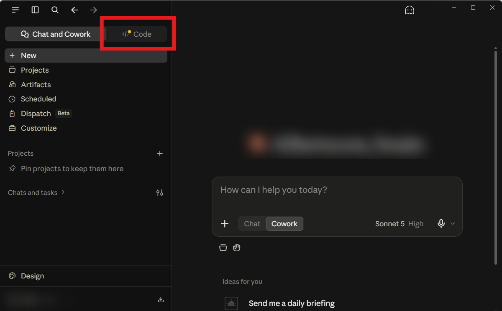
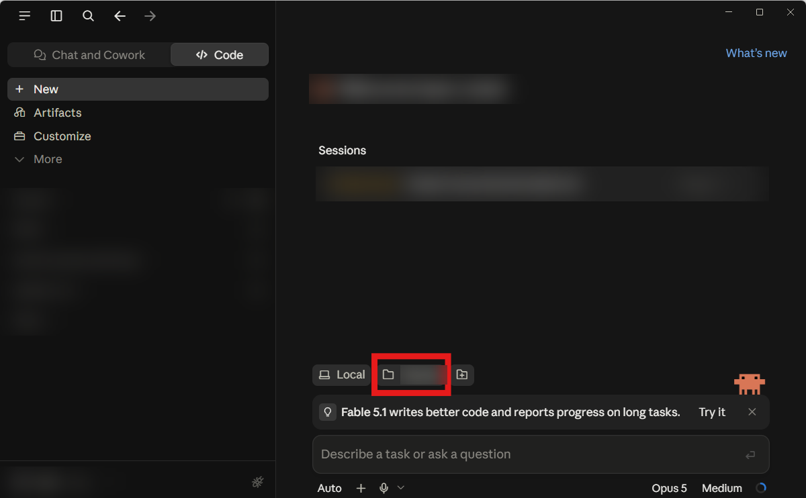
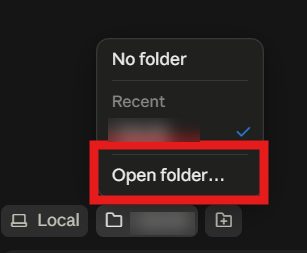

# Getting started, from zero

This assumes nothing. If you have never installed Python, never used an AI coding
agent, and are not sure what a "terminal" is, you are the person this page is for.

Budget about thirty minutes. Do the steps in order — each one depends on the last.

**You will not need to type a single terminal command.** Everything below is downloads,
buttons, and one sentence typed into a chat box.

---

## What you are setting up

Four pieces, and it helps to know what each is for:

| Piece | What it does |
|---|---|
| **This knowledge base** | Markdown files. Not a program. It teaches your AI coding agent how PowerWorld actually behaves |
| **Python** | The language your agent will write code in |
| **An AI coding agent** | The program that reads the knowledge and writes the code. Claude Code, Codex, Cursor |
| **Two Python packages** | `esapp` talks to PowerWorld; `TeamOverbyeWeather` downloads weather. Your agent installs these for you |

Throughout this page, **"agent"** means the AI coding agent, the program from row three.
An agent can open your files and run code on your computer. A chat window cannot.

PowerWorld Simulator itself is a fifth piece, but you either already have it through your
university or employer, or you do not. See [About the PowerWorld
licence](#about-the-powerworld-licence) below — a small part still works without it, but
most of this kit is about operating Simulator.

---

## Step 1 — Download the knowledge base

At the top of the repository page, click the green **Code** button, then
**Download ZIP**.

Unzip it somewhere you will find again. `Documents` is fine. You should end up with a
folder named `PowerWorldHiveMind` containing `AGENTS.md`, `README.md`, and folders
called `methods`, `concepts`, `demos` and `references`.

You do not need a GitHub account, and you do not need `git` for this step.

**Remember where this folder is.** Every later step refers to it.

---

## Step 2 — Install Python

Go to [python.org/downloads](https://www.python.org/downloads/) and click the big
download button. Run the installer when it finishes.

**On the first screen, tick "Add Python to PATH" before clicking Install Now.**

This is the single most common thing to get wrong. The checkbox is small, at the bottom,
and unticked by default. Without it, later steps fail with errors that do not tell you
why.

You do not have to verify this yourself. Your agent checks it in Step 6.

---

## Step 3 — Install your AI coding agent

### The recommended route: the Claude desktop app

Download it from **[claude.com/download](https://claude.com/download)**, run the
installer, and sign in.

**Downloading is not installing.** The download leaves a file sitting in your `Downloads`
folder and nothing happens until you open it. Look in `Downloads` for a file whose name
starts with `Claude` and ends in `.exe`, and double-click it.

Once it is installed, Claude does not put an icon on your desktop, so an empty desktop is
not a sign that anything went wrong. Open Start, type `Claude`, right-click the result and
choose **Pin to taskbar**, and it will be there next time.

**Two things must be true or this will not work:**

| Requirement | Why |
|---|---|
| **A paid Claude plan**: Pro, Max, Team or Enterprise | The free plan does not include Claude Code. If the **Code** button asks you to upgrade, that is the reason, and nothing is broken |
| **Git installed** ([git-scm.com/downloads/win](https://git-scm.com/downloads/win)) | On Windows, local sessions do not start without it. Click through the installer with all the default options |

You do **not** need Node.js, and you do **not** need to install anything from a terminal.
The desktop app includes Claude Code.

### Other agents

Any agent that runs on your computer and can read your files will work with this kit:

| Agent | Where |
|---|---|
| **Claude Code** *(best supported here)* | [claude.com/download](https://claude.com/download) for the app, or [code.claude.com/docs/en/setup](https://code.claude.com/docs/en/setup) for the command-line version |
| **Codex** (OpenAI) | [github.com/openai/codex](https://github.com/openai/codex) |
| **Cursor** | [cursor.com](https://cursor.com) |
| **Windsurf** | [windsurf.com](https://windsurf.com) |

If you pick one of these, the buttons in Steps 4 and 5 will look different, but every one
of them has some way to open a folder. Skip to [Using a
terminal instead](#using-a-terminal-instead) if yours is command-line only.

### If you have no paid plan

**You can still use this knowledge base, just not hands-free.** Upload one of the bundled
files from the [`dist/`](dist/) folder to any free chat, Claude or ChatGPT, and ask your
question there:

| File | Contains |
|---|---|
| `powerworld-hivemind-methods.md` | The how-to pages. Start here |
| `powerworld-hivemind-concepts.md` | Background and theory |
| `powerworld-hivemind-demos.md` | Worked examples |
| `powerworld-hivemind-bundle.md` | Everything. Too large for most free chats |

The chat reads the knowledge and writes code for you to run yourself. It cannot run that
code, see the error, and fix it, so you copy results back and forth by hand.

---

## Step 4 — Switch to Code

Open Claude. At the **top left** there is a toggle with two halves: `Chat and Cowork` and
`Code`.

**Click `Code`.**



`Chat and Cowork` is the ordinary conversation mode. It cannot see the files on your
computer. `Code` can. Landing in the wrong one is the most common way to get stuck on this
page.

---

## Step 5 — Point it at the knowledge base

This step is where people go wrong, and the failure is silent. The agent works, it just
does not know the knowledge base exists.

At the bottom of the window, just above the box where you type, there is a row of small
buttons. The first says **`Local`**, meaning *use my own computer and my own files*.
Leave it on `Local`.

Next to it is a **folder button**. Click it.



A short menu opens. Choose **`Open folder…`**, then select the `PowerWorldHiveMind` folder
you unzipped in Step 1.



The folder button now reads `PowerWorldHiveMind`.

---

## Step 6 — Your first question

In the box that says **"Describe a task or ask a question"**, type this:

> Read AGENTS.md. Check whether Python is installed, install the `esapp` and
> `TeamOverbyeWeather` packages if they are missing, then run the preflight check to see
> if PowerWorld works on this machine.

It will read the instructions, set up the two Python packages, and run five quick checks.
One of three things happens:

**Everything passes.** You are ready. Skip to [What to ask next](#what-to-ask-next).

**It cannot find Python.** The "Add Python to PATH" box in Step 2 was not ticked. Re-run
the Python installer, choose **Modify**, and turn on "Add Python to environment
variables". Then ask your agent to try again.

**It fails on SimAuto or a licence.** Read the next section. This one is not fixable in
code.

---

## About the PowerWorld licence

PowerWorld automation needs three things, and the third catches almost everyone:

1. **Windows.** The interface PowerWorld exposes for automation is Windows-only. There is
   no Mac or Linux version.
2. **PowerWorld Simulator, installed and licensed.**
3. **The SimAuto add-on, licensed separately.**

That third point is the one to understand. **SimAuto is a different licence from
Simulator.** Your Simulator can open cases perfectly, run studies, and look completely
healthy, while every line of automation fails — and nothing in the program tells you this
is why.

If preflight fails on that check, no amount of changing the code will help. Ask whoever
administers your PowerWorld licence whether it includes SimAuto.

### If you have no PowerWorld licence

**A small part still works.** Fetching and inspecting weather data is pure Python:

- Downloading ERA5, HRRR, and NOAA weather data
- Reading, cropping, and combining `.pww` weather files

That is where it stops without a licence: *using* those files means PowerWorld's TimeStep
feature, which runs inside Simulator.

Ask your agent:

> Read methods/teamoverbyeweather-client.md and download February 2021 weather for Texas.

No licence, no Windows requirement, no PowerWorld.

---

## What to ask next

Once preflight passes, ask in plain English. The agent finds the right pages itself.

> Open my case at C:\path\to\case.pwb and summarize it.

> Which branches are most heavily loaded in this case?

> Load this weather file and run a timestep simulation to get hourly wind and solar output
> for the renewable generators.

> Add a 138 kV line between bus 12 and bus 40 and tell me what it does to overloads.

> Run an N-1 contingency analysis and show me the worst violations.

You do not need to know which file covers what. That is what `AGENTS.md` is for.

---

## Using a terminal instead

Skip this unless you are using a command-line agent such as the Claude Code CLI or Codex,
or you simply prefer typing.

**New to terminals?** Anthropic's [terminal
guide](https://code.claude.com/docs/en/terminal-guide) walks through it properly.

Your agent must be **started inside the folder you unzipped in Step 1**. The easy way to
do that on Windows, with no paths to type:

1. Open the `PowerWorldHiveMind` folder in File Explorer, the normal way.
2. Click the **address bar** at the top (the strip showing the folder path) so it
   highlights.
3. Type `cmd` and press Enter.

A terminal opens, already sitting in that folder. Check you are in the right place:

```
dir
```

(`ls` on Mac.) **You should see** `AGENTS.md`, `README.md`, `index.md`, and the `methods`,
`concepts`, `demos` and `references` folders.

Then start your agent from that same window: `claude` for the Claude Code CLI, `codex`
for Codex. Install commands for each are on their own sites; see the table in Step 3.

To install the two Python packages yourself rather than letting the agent do it:

```
pip install esapp TeamOverbyeWeather
```

**If you see** `'pip' is not recognized` — Python is not on your PATH. Go back to Step 2.
**If you see** a permissions error, add `--user` after `install`.

---

## When something goes wrong

**I downloaded Claude but I cannot find it.** Two different things cause this and they
look identical. Either the installer downloaded and was never run — look in `Downloads`
for a file starting with `Claude` and ending in `.exe`, and double-click it. Or it did
install and you are looking at the desktop, where Claude puts no icon: open Start, type
`Claude`, right-click the result and choose **Pin to taskbar**.

**The agent does not seem to know about PowerWorld.** It is pointed at the wrong folder.
See Step 5. Or just tell it: `Read AGENTS.md in this folder.`

**There is no Code button in the Claude app.** Your app is an older version. Reinstall
from [claude.com/download](https://claude.com/download).

**Clicking Code asks you to upgrade.** Claude Code needs a paid plan. See Step 3, or use
the [`dist/`](dist/) bundles with a free chat instead.

**The agent writes code that errors.** Ask it to check its approach against the knowledge
base: `Check methods/preflight-powerworld.md and the relevant page — is this the
documented way to do it?`

**Everything fails with a COM or licence error.** See [About the PowerWorld
licence](#about-the-powerworld-licence). This is not fixable in code.

**An answer looks wrong.** Ask which pages it used: `Which pages from this knowledge base
did you use?` If a page is wrong, that is a bug worth reporting — open an issue on the
repository saying which page and what it got wrong.

---

## Where to go from here

- **[index.md](index.md)** — every page, one line each
- **[AGENTS.md](AGENTS.md)** — what your agent reads; worth skimming to see what it knows
- **[README.md](README.md)** — the short version of this page
