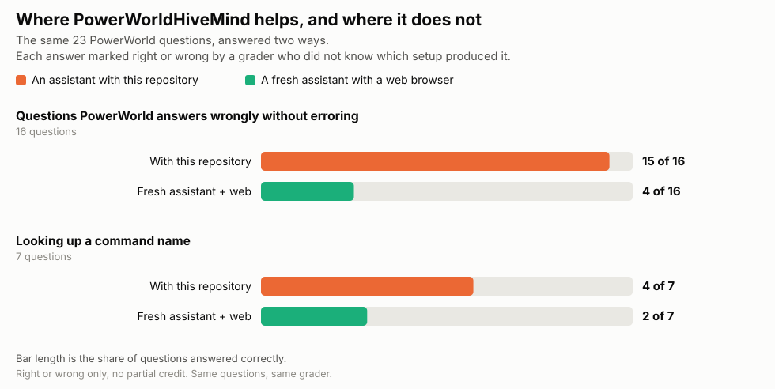

# PowerWorldHiveMind

<p align="center">
  
</p>

<p align="center"><strong>Your agent on PowerWorldHiveMind.</strong></p>

### Tired of babysitting your coding agent?

Confused why it keeps coming back with errors it should have solved itself? Tired of
explaining, again, that `SaveCase` silently does nothing and that a filtered write
changes nothing at all?

**PowerWorldHiveMind juices up your agent.** Drop it in, and your assistant stops
guessing at PowerWorld and starts knowing it — including the dozen failures that never
raise an exception and quietly hand you a wrong answer.

You give it a case. It gives you the analysis. You stop being the documentation.

**Does it work? We measured it.** Against the same 23 questions, a capable assistant with
this repository solved **19**; the same assistant with a web browser and no PowerWorld
knowledge solved **6**. On the failures PowerWorld never reports as failures the split is
**15 to 4**. On looking up a command name it is weaker than a web
search, and the page says so. Every answer was marked by a grader that did not know which
setup wrote it. [**See the benchmark**](BENCHMARK.md).

### Built for the study, not the query

"Which branches are overloaded" is where most tooling stops. The work starts after that
readout:

| Instead of | You get |
|---|---|
| "12 N-1 violations" | *"All 12 come from one corridor — the four parallel 69 kV circuits between bus 19 and 23. Losing any one overloads the other three."* |
| "here are the loadings" | *"Build 19→23 and violations go 12 → 2. Do **not** build 27→29 — I tested it, and it makes N-1 worse."* |
| "the 2024 case has more branches" | *"The plan adds 691 branches and 199 generators, retires nothing, and none of it is a renumbering artifact — I checked."* |
| "the case has renewables" | *"9 of 45 units carry PFW models, so this case can run a weather study. Here is the hourly output."* |

It diagnoses, proposes a fix, applies it, re-verifies, and tells you which options to
reject. In [the remediation demo](demos/violation-remediation.md), two of five plausible
reinforcements made the system worse, including the one an engineer would pick first.
Reasoning about a network does not tell you that. Measuring it does.

This repository is a knowledge base — 44 linked markdown files about driving PowerWorld
Simulator from Python. There is no software to run. You download it, point your AI assistant at it, and it starts
writing PowerWorld code that works instead of code that looks plausible.

Hand it a case file and ask a question in plain English:

> *"Here's my case at `C:\cases\mysystem.pwb`. Which branches are most heavily loaded?"*
>
> *"Add a 138 kV line between bus 12 and bus 40 and tell me what it does to the
> N-1 violations."*

---

## Fastest setup: paste this to your agent

If you use **Claude Code, Codex CLI, Cursor, or Windsurf**, you do not need any of the
manual steps below. Paste this whole block into it:

```
Set this up for me:
1. git clone https://github.com/ChunSikPark/PowerWorldHiveMind.git
2. pip install esapp TeamOverbyeWeather
3. Read PowerWorldHiveMind/AGENTS.md
4. Run the preflight in PowerWorldHiveMind/methods/preflight-powerworld.md and
   tell me whether PowerWorld automation works on this machine.
Then you are my PowerWorld expert - I will give you a case file next.
```

It will do all four steps and report back. Your agent is now juiced.

**This does not work in the ChatGPT or Claude websites.** They have no access to your
computer: they cannot clone, install, or run anything, and pasting the link only lets
them browse a few pages. For those, use the uploads in [`dist/`](dist/) - see
[Using it with ChatGPT or the Claude website](#using-it-with-chatgpt-or-the-claude-website).

---

## See it work

Worked runs on a real 37-bus case — **real output, including the failures**:

| Demo | What it shows |
|---|---|
| [**Comparing planning cases**](demos/comparing-planning-cases.md) | **Multi-case.** Diff a 2016 vs 2024 case: 691 new branches, 199 new generators, then a contingency set for only the new devices — and the trap that makes the naive answer 87% wrong |
| [**Violation remediation**](demos/violation-remediation.md) | **The full study.** Diagnose 12 N-1 violations down to one cause, test five reinforcements, rank them — and find that two make things worse |
| [Adding a device](demos/adding-a-device.md) | Three attempts that reported success and created nothing, then the fix. The silent-failure problem in full |
| [Power flow & sensitivities](demos/power-flow-and-sensitivities.md) | AC, DC, LODF, PTDF — with the `1e8` sentinel and an error whose obvious fix fails the same way |
| [Contingency & aux](demos/contingency-and-aux.md) | N-1 from scratch, then auto-generating a filter + contingency `.aux` |
| [Weather to megawatts](demos/timestep-and-pfw.md) | PFW models, TimeStep, and why "zero output" is usually a setup bug |
| [Handling errors](methods/handling-errors.md) | How the agent recovers on its own, and the three cases where it should stop and ask you |

Just say what you want — [the full prompt list](demos/start-here.md):

> *"Which branches are most heavily loaded?"*
> *"Add a line between bus 27 and bus 31 and tell me if it helps N-1."*
> *"Run N-1 on everything."*
> *"Build me a contingency file for the five most loaded lines."*
> *"Run N-1, work out what's wrong, and tell me what to build to fix it."*
> *"Compare my 2016 and 2024 cases and tell me what the plan builds."*

---

## Does it actually help?

**[BENCHMARK.md](BENCHMARK.md)** — the same AI model answered the same 23 PowerWorld questions
two ways: with PowerWorldHiveMind on disk, and as a capable assistant told nothing about
PowerWorld but free to search the open web. Every answer was then marked right or wrong by a
grader that did not know which setup wrote it.



**On the things PowerWorld gets wrong quietly, it is not close.** 16 questions where
Simulator accepts your call, reports success and returns something wrong: HiveMind solved
**15**. A fresh assistant with the whole open web solved 4. Public
documentation says what a command does; it does not say that the call returns success and
writes nothing.

**On looking up a command name, open PowerWorld's manual instead.** HiveMind managed
4 of 7 there and spent more searches doing it than the web did. This
repository deliberately does not publish argument syntax, so it will sometimes name the right
command and still not give you a signature to call it with.

Overall: **19 of 23 against 6 of 23**. The page gives every question individually, what
each setup answered, what it cost, and — at some length — the ways an earlier version of this
benchmark was wrong.

---

## Never used this kind of thing before? Start here.

This section assumes you have never installed Python and have never used an AI coding
assistant. If that is not you, skip to [Install](#install).

Full walkthrough with screenshots of what you should see at each step:
**[GETTING-STARTED.md](GETTING-STARTED.md)**

There are four things to get, in this order. Budget about thirty minutes.

### 1. Get this knowledge base

Click the green **Code** button at the top of this page, then **Download ZIP**. Unzip it
somewhere you can find again — your Documents folder is fine.

You do not need `git`. You do not need an account.

### 2. Get Python

Download it from [python.org/downloads](https://www.python.org/downloads/) and run the
installer.

**One thing matters:** on the first installer screen, tick the box that says
**"Add Python to PATH"** before clicking Install. It is easy to miss and everything
downstream breaks without it.

Check it worked — open Command Prompt and type:

```
python --version
```

If you see a version number, you are done. If you see "not recognized", the PATH box was
not ticked; re-run the installer and choose Modify.

### 3. Get an AI coding agent

You need one that runs **on your computer** and can read your files. Pick any:

| Agent | Download | Install command |
|---|---|---|
| **Claude Code** *(best supported here)* | [claude.com/claude-code](https://claude.com/claude-code) | `npm install -g @anthropic-ai/claude-code` |
| **Claude Desktop** | [claude.ai/download](https://claude.ai/download) | installer for Mac/Windows |
| **Codex CLI** (OpenAI) | [github.com/openai/codex](https://github.com/openai/codex) | `npm install -g @openai/codex` |
| **Cursor** | [cursor.com](https://cursor.com) | installer |
| **Windsurf** | [windsurf.com](https://windsurf.com) | installer |

The npm ones need [Node.js](https://nodejs.org) first.

**Browser chat is not enough.** [chatgpt.com](https://chatgpt.com) and
[claude.ai](https://claude.ai) in a browser cannot open your `.pwb`, run Python, or reach
PowerWorld. They can still read this knowledge and write code for you to run yourself —
upload a file from [`dist/`](dist/) — but "hand it a case, get an answer" needs one of
the agents above.

### 4. Get the Python packages

Open Command Prompt in the folder where you unzipped this repository, and run:

```
pip install esapp TeamOverbyeWeather
```

`esapp` drives PowerWorld. `TeamOverbyeWeather` downloads weather data.

### Then: your first question

Start your AI assistant **in the folder where you unzipped this repository** — that part
matters, since it is how the assistant finds the knowledge. Then ask:

> Read AGENTS.md, then run the preflight check to see if PowerWorld works on this
> machine.

If preflight passes, ask it anything from the table below.

---

## About PowerWorld itself

The PowerWorld half of this kit needs three things, and the third one catches people
out:

| Requirement | Notes |
|---|---|
| **Windows** | PowerWorld automation uses a Windows-only interface. No Mac or Linux version exists |
| **PowerWorld Simulator, installed and licensed** | This kit drives Simulator; it does not replace it |
| **The SimAuto add-on, licensed** | **Licensed separately from Simulator.** Your Simulator can work perfectly while automation is unavailable, and the program gives you no hint |

Without a PowerWorld licence, most of this kit is not usable — it is about operating
Simulator. The exception is fetching and inspecting weather data, which is pure Python:
see [methods/teamoverbyeweather-client.md](methods/teamoverbyeweather-client.md). But
*applying* that weather requires PowerWorld, since TimeStep runs inside Simulator.

---

## Install

**Claude Code — two lines, nothing to keep track of:**

```
/plugin marketplace add ChunSikPark/PowerWorldHiveMind
/plugin install powerworld-hivemind
```

Start a new session so the plugin loads, then run `/powerworld-setup`. That installs the
Python packages and checks whether this machine can drive PowerWorld at all, including the
separately-licensed SimAuto add-on that catches most people.

**Codex** reads the portable plugin manifest this repo also ships:

```
codex plugin marketplace add ChunSikPark/PowerWorldHiveMind
```

Then open `/plugins`, install **powerworld-hivemind**, and start a new session. *(Not yet
tested against a released Codex build — if it fails, clone it by hand and open an issue.)*

**By hand**, for any other agent, or when you want the files somewhere you can read them:

```bash
git clone https://github.com/ChunSikPark/PowerWorldHiveMind.git
cd PowerWorldHiveMind
pip install esapp TeamOverbyeWeather
```

Then start your agent in that directory. There is no `/powerworld-setup` on this route —
ask the agent to read `AGENTS.md` and run the preflight instead.

New to all of this? [GETTING-STARTED.md](GETTING-STARTED.md) walks through it from zero.

### Which file your agent actually reads

The instructions live in `AGENTS.md`. Not every tool loads that filename, so the kit
ships a shim for the ones that don't — there is nothing for you to configure.

| Your agent | Loads | Shipped as |
|---|---|---|
| Codex, Cursor, GitHub Copilot, Windsurf | `AGENTS.md` | the file itself |
| Claude Code | `CLAUDE.md` | a one-line `@AGENTS.md` import |
| Gemini CLI | `GEMINI.md` | a generated copy of `AGENTS.md` |

Verified against each vendor's own documentation on 2026-09-09 — read off the docs, not
smoke-tested on an installed client. `GEMINI.md` is generated: edit `AGENTS.md` instead,
or your change is overwritten.

Using something not on the list? Find out which filename it loads at startup. If it is
not one of the three above, point it at `AGENTS.md` yourself — and please open an issue,
so the next person does not have to work it out twice.

**Into an existing project:** copy the cloned `PowerWorldHiveMind` folder in as a
subdirectory. The kit is plain markdown — nothing to build, nothing to run.

---

## Using it with ChatGPT or the Claude website

A browser chat cannot open your `.pwb`, run Python, or reach SimAuto. It can still read
this knowledge and **write correct code for you to run yourself**, which is most of the
difficulty. Pre-built uploads live in [`dist/`](dist/):

| You are using | Upload | Notes |
|---|---|---|
| **claude.ai** — as a Skill | `dist/powerworld-hivemind-skill.zip` | Settings → Capabilities → Skills. Paid plans only |
| **claude.ai** — as a Project | `dist/powerworld-hivemind-bundle.md` | Add to Project knowledge; one file, ~84k tokens |
| **ChatGPT** — Custom GPT | the three `dist/powerworld-hivemind-{methods,concepts,references}.md` | Split to stay under the knowledge-file cap |
| **A one-off chat** | `dist/powerworld-hivemind-bundle.md` | Attach it and ask your question |

Then ask normally. The assistant will hand you code; you run it on the machine that has
PowerWorld.

**For the full experience** — where you hand over a case file and get an answer back —
you need an assistant that can read your disk and run code: Claude Code, Codex CLI,
Cursor, or Windsurf. See [Install](#install).

---

## What it covers

| Area | Pages |
|---|---|
| Driving PowerWorld from Python | Opening cases, reading and writing data, solving power flow, saving |
| Building and modifying cases | Adding buses, lines, loads and generators; applying a dispatch; reclassifying branches |
| Contingency analysis | Building contingency sets, reading violations, ranking devices by severity |
| **Multi-case comparison** | **Diffing two planning vintages, classifying NEW / RETIRED / UPGRADED / RENUMBERED, and generating contingency sets for just the new devices** |
| **Violation remediation** | **Diagnosing the cause, proposing reinforcements or redispatch, applying them, and re-verifying N-1** |
| PowerWorld weather features | The PWW format, and fetching `.pww` files with the TeamOverbyeWeather client |
| Timestep simulation | Driving PowerWorld's TimeStep feature for hourly renewable output, and reading the result CSVs |
| Script actions | 198 PowerWorld SCRIPT commands, organized by task |

Full catalogue: **[index.md](index.md)**

### What it does not cover

Contingency analysis fundamentals, OPF formulation, PV/QV curve studies, and transient
stability theory. Nor weather science — dynamic line ratings, IEEE 738 thermal
modelling, and extreme-event selection are deliberately out of scope.

This kit is about **operating PowerWorld**. It will tell you which script action runs a
PV study; it will not teach you what a PV curve means.

---

## Why this exists

Most PowerWorld automation problems are not hard, they are *quiet*. A write to a
filtered subset does nothing and reports success. The COM `SaveCase` silently no-ops. A
DC solve reports zero mismatch even when the generation schedule is short by a gigawatt.
Contingency results persist stale inside the case file, so a fresh read can be from last
week's run.

None of that is in the vendor documentation, and an AI assistant working from general
knowledge will confidently walk into every one of them. These pages are the accumulated
list of what actually goes wrong, written so an assistant reads the warning at the exact
moment it is about to make the mistake.

---

## Credits and contributing

Built on [`esapp` (ESA++)](https://github.com/lukelowry/ESApp), the Apache-2.0 PowerWorld
SimAuto wrapper from Texas A&M, and [`TeamOverbyeWeather`](https://pypi.org/project/TeamOverbyeWeather/).

- A bug in the **package** → [the esapp repository](https://github.com/lukelowry/ESApp)
- A page here that is **wrong or missing** → open an issue on this repository, and say
  which page

Page defects are the more valuable report. Every page here exists because someone lost
time to the thing it documents.

PowerWorld Simulator is commercial software of PowerWorld Corporation. This is an
independent knowledge base and is not affiliated with or endorsed by them.

## For agents

Read [AGENTS.md](AGENTS.md). It has the traversal protocol, the task-routing table, and
the seven rules that fail silently.
